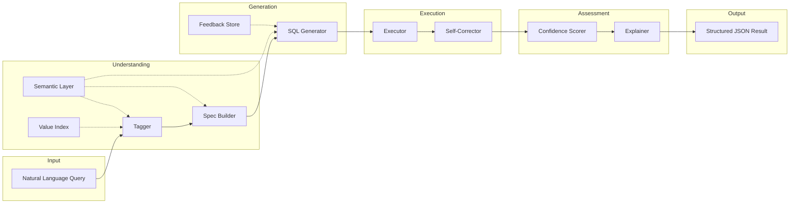
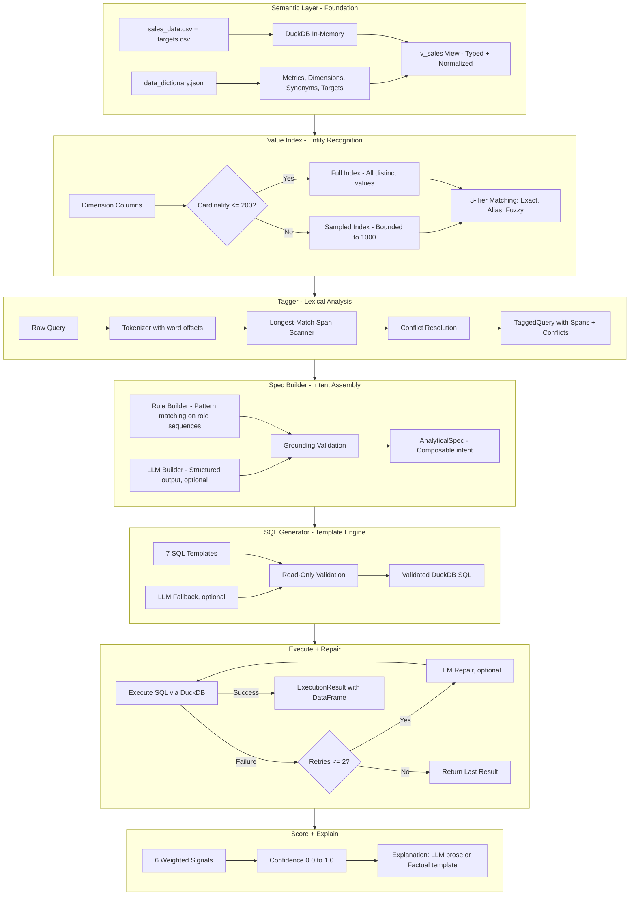
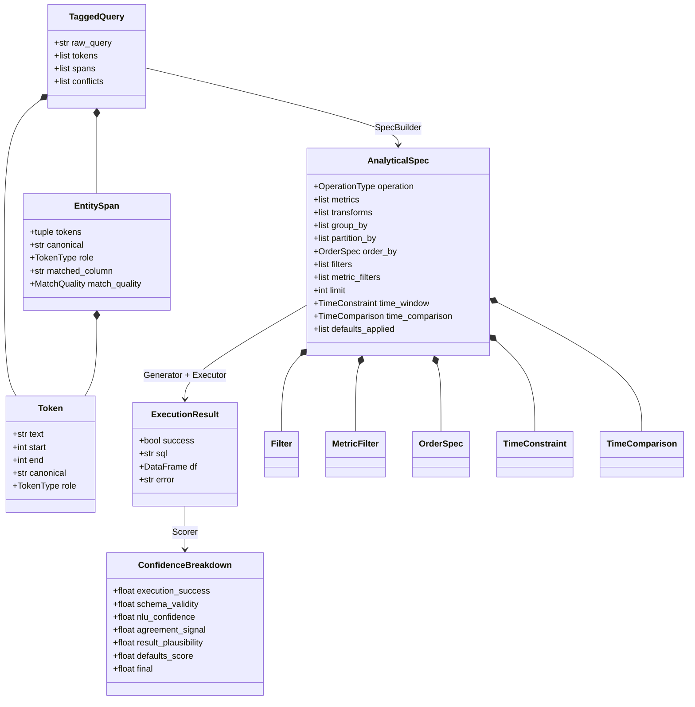
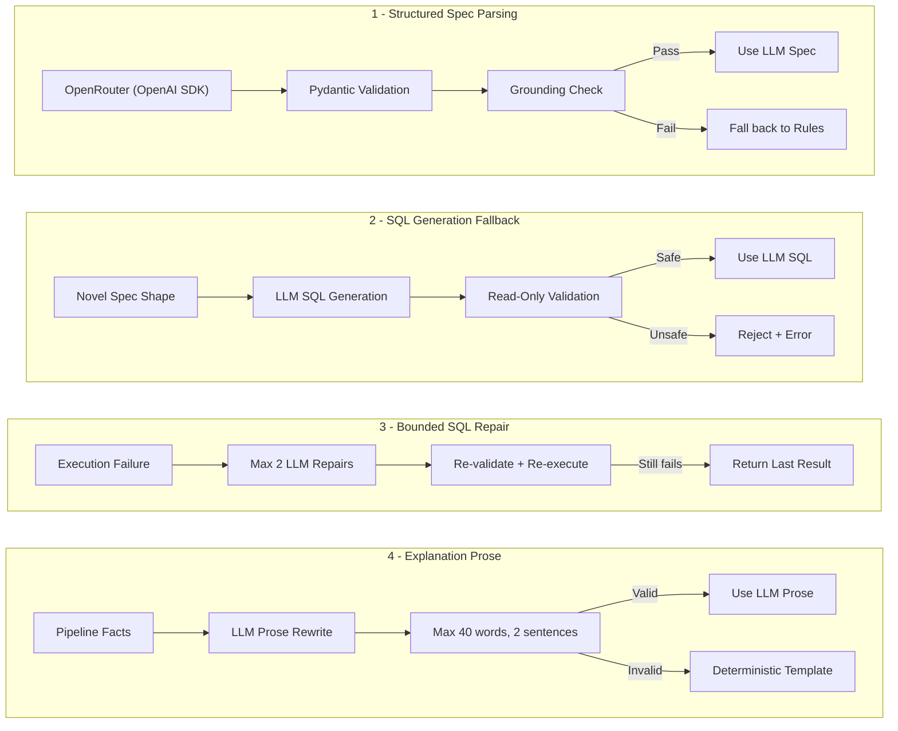
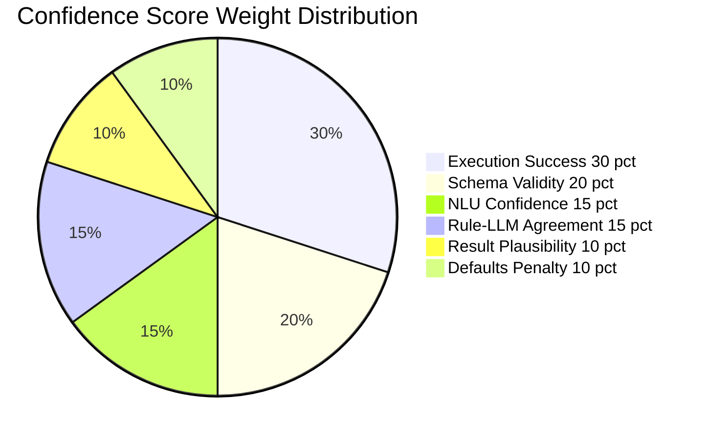
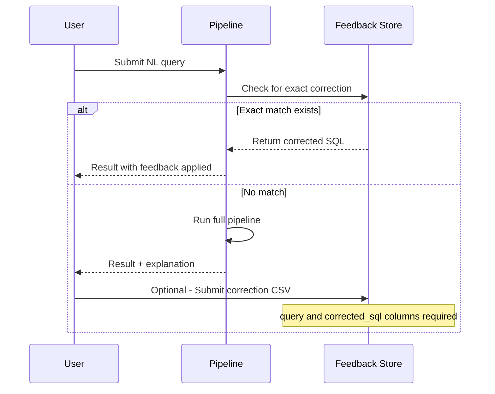

<div align="center">

# 🧠 Intelligent Analytics Query Engine

### *Transform natural language into precise, auditable SQL — without the black box*

[](https://www.python.org)
[](https://duckdb.org)
[](https://pandas.pydata.org)
[](#-testing)

</div>

---

## 📖 Table of Contents

- [Overview](#-overview)
- [Approach](#-approach)
- [Architecture](#-architecture)
  - [High-Level Pipeline](#high-level-pipeline)
  - [Phase-by-Phase Breakdown](#phase-by-phase-breakdown)
  - [Type System & Data Flow](#type-system--data-flow)
  - [LLM Integration Points](#llm-integration-points)
- [Project Structure](#-project-structure)
- [Trade-offs](#-trade-offs)
- [Getting Started](#-getting-started)
- [Output Format](#-output-format)
- [Testing](#-testing)
- [Feedback Loop](#-feedback-loop)

---

## 🌟 Overview

This project converts **natural-language analytics questions** (e.g., *"Top 2 cities by profit"*, *"YoY growth in revenue"*) into **validated, read-only DuckDB SQL** and returns structured results with **confidence scores** and **human-readable explanations**.

Unlike end-to-end LLM approaches, this engine uses a **multi-phase deterministic pipeline** with optional LLM augmentation at controlled seams, providing **auditability**, **reproducibility**, and **safety** without sacrificing flexibility.

```
"Total sales in India for March"
        ↓
   SELECT SUM(quantity * unit_price * (1 - discount)) AS value
   FROM v_sales
   WHERE country = 'India' AND month = '2024-03'
        ↓
   { "result": [{"value": 12345.67}], "confidence_score": 0.93 }
```

---

## 🎯 Approach

### Core Philosophy: *Deterministic First, LLM Second*

The engine is designed around a key insight: **most analytics queries follow recognizable structural patterns**. Rather than delegating everything to an LLM (risking hallucination, SQL injection, or schema drift), the system is built on four pillars:



```mermaid
graph TD
    DP["Design Principles"]

    SF["Safety First"]
    DC["Deterministic Core"]
    CS["Composable Stages"]
    LA["LLM as Augmentation"]

    SF1["Read-only SQL enforcement"]
    SF2["Identifier allowlisting"]
    SF3["Literal validation"]
    SF4["Bounded retry limits"]

    DC1["Rule-based spec building"]
    DC2["Template-driven SQL gen"]
    DC3["Reproducible confidence"]
    DC4["Observable signals"]

    CS1["Protocol-driven interfaces"]
    CS2["Phase isolation"]
    CS3["Independent testability"]
    CS4["Clean dependency graph"]

    LA1["Structured parsing fallback"]
    LA2["Bounded SQL repair"]
    LA3["Prose explanation"]
    LA4["Grounding validation"]

    DP --> SF
    DP --> DC
    DP --> CS
    DP --> LA

    SF --> SF1
    SF --> SF2
    SF --> SF3
    SF --> SF4

    DC --> DC1
    DC --> DC2
    DC --> DC3
    DC --> DC4

    CS --> CS1
    CS --> CS2
    CS --> CS3
    CS --> CS4

    LA --> LA1
    LA --> LA2
    LA --> LA3
    LA --> LA4
```

**The pipeline operates in 7 distinct phases**, each with a single responsibility and a clear contract. Every phase can be tested independently, and LLM involvement is always **optional**, **bounded**, and **validated**.

### Why Not Just Use an LLM?

| Concern | Pure LLM Approach | This Engine |
|---------|-------------------|-------------|
| **Hallucinated columns** | Common — LLMs invent plausible column names | Impossible — all identifiers validated against live schema |
| **SQL injection** | Risk from string interpolation | Prevented — operator allowlisting + literal validation |
| **Non-determinism** | Different SQL each run | Same query → same SQL (deterministic path) |
| **Auditability** | Opaque prompt → SQL | Each phase emits inspectable intermediate artifacts |
| **Cost & Latency** | Every query hits API | API calls only for optional enhancements |
| **Offline operation** | Requires API credentials | Fully functional without any LLM |

---

## 🏗 Architecture

### High-Level Pipeline



### Phase-by-Phase Breakdown



### Type System & Data Flow

The pipeline is unified by a rich, frozen type system that flows between stages:



### LLM Integration Points

The engine defines **four optional LLM seams**, each with strict contracts and fallback behavior:



> **Key Guarantee**: The entire pipeline runs without any API credentials. LLM features enhance — but never gate — core functionality.

---

## 📁 Project Structure

```
text-tosql/
├── main.py                          # CLI entry point & pipeline orchestrator
├── dataset/
│   ├── sales_data.csv               # Source sales transactions
│   ├── targets.csv                  # Revenue targets for comparison queries
│   ├── data_dictionary.json         # Metrics, dimensions, synonyms, mappings
│   └── nl_queries.json              # 8 natural-language query batch
├── engine/
│   ├── interfaces.py                # Protocol contracts (SemanticLayer, ValueIndex, Tagger)
│   ├── types.py                     # Frozen data contracts (Token, EntitySpan, AnalyticalSpec, etc.)
│   ├── semantic_layer.py            # DuckDB schema, view registration, data quality
│   ├── tagger.py                    # Deterministic lexical tagger with conflict resolution
│   ├── value_index.py               # Cardinality-tiered exact/fuzzy value lookup
│   ├── understanding/
│   │   ├── spec_builder.py          # Orchestrates rule + optional LLM spec construction
│   │   ├── rule_builder.py          # Deterministic role-sequence pattern matcher
│   │   ├── llm_builder.py           # Optional OpenRouter structured output builder
│   │   ├── temporal_anchor.py       # Time constraint resolution
│   │   └── prompts.py               # LLM prompt templates
│   ├── generation/
│   │   ├── generator.py             # SQL generation with template engine + LLM fallback
│   │   ├── templates.py             # 7 validated SQL grammar templates
│   │   └── prompts.py               # SQL generation prompt templates
│   ├── execution/
│   │   └── executor.py              # Safe SQL execution with structured results
│   ├── correction/
│   │   ├── repairer.py              # Bounded self-correction (max 2 retries)
│   │   └── prompts.py               # SQL repair prompt templates
│   ├── scoring/
│   │   └── scorer.py                # 6-signal weighted confidence scorer
│   ├── insight/
│   │   ├── explainer.py             # Deterministic + optional LLM explanation
│   │   └── prompts.py               # Explanation prompt templates
│   └── memory/
│       └── feedback_store.py        # Verified exact-match correction store
├── tests/                           # 14 comprehensive test suites
├── scripts/
│   └── verify_setup.py              # Environment verification script
├── pyproject.toml                   # Project metadata & dependencies
└── requirements.txt                 # Pinned dependency ranges
```

---

## ⚖️ Trade-offs

### Deterministic Rules vs. LLM Flexibility

The design occupies a deliberate position in the **coverage vs. control** trade-off space:

| Position | Coverage | Control | Notes |
|----------|----------|---------|-------|
| **Pure LLM Pipeline** | High | Low | Handles novel queries but hallucinates, no safety guarantees |
| **This Engine (with LLM seams)** | High | High | Best of both — deterministic core with bounded LLM augmentation |
| **This Engine (deterministic only)** | Medium | Very High | Fully offline, fully reproducible, zero API cost |
| **Regex Only** | Low | Very High | Brittle, covers very few query shapes |

### Design Decisions

| Decision | Chosen Approach | Alternative | Rationale |
|----------|----------------|-------------|-----------|
| **Primary path** | Deterministic rules over tagged role sequences | End-to-end LLM generation | Reproducibility, auditability, zero API cost for common queries |
| **Spec construction** | Pattern-match on `(metric, dimension)`, `(number, dimension, metric)`, etc. | Free-form LLM intent parsing | Finite supported patterns are provably correct; LLM fallback covers novel shapes |
| **SQL generation** | 7 pre-validated templates | LLM-generated SQL every time | Templates guarantee read-only safety and schema binding; LLM fallback extends coverage |
| **Value matching** | Cardinality-tiered indexing (exact ≤200, sampled >200) | Full-text search or embedding similarity | Bounded memory, predictable latency; trades recall on high-cardinality columns |
| **Fuzzy matching** | `SequenceMatcher` with 0.85 threshold, min 4 chars | Levenshtein distance or embedding | Standard library — no extra dependency; threshold prevents false positives |
| **SQL repair** | Max 2 bounded retries with schema context | Unlimited retries or no repair | Limits cost/latency while recovering from common binding errors |
| **Confidence scoring** | 6-signal weighted formula (execution, schema, NLU, agreement, plausibility, defaults) | Single binary pass/fail | Transparent, inspectable signals; weights are tunable but not ML-trained |
| **Explanation** | LLM prose (≤40 words, 2 sentences) with deterministic fallback | Always LLM or always template | LLM prose is more natural; strict validation prevents confabulation; fallback ensures availability |
| **Feedback** | Exact normalized query match only | Semantic similarity matching | Prevents applying a correction to the wrong intent; similar matches available for review |
| **Database** | DuckDB in-memory | PostgreSQL, SQLite, or Spark | Zero setup, fast analytics on CSV, portable; trades persistence for simplicity |

### What This Engine Does _Not_ Do

> These are intentional scope boundaries, not limitations:

- **No multi-table joins beyond targets** — The `v_sales` view is the single source of truth. Complex multi-fact schemas need a different architecture.
- **No query disambiguation UI** — Ambiguous queries are resolved deterministically (highest-confidence span wins). A conversational clarification flow is a future extension.
- **No learned ranking** — Confidence weights are handcrafted. ML-trained weights could improve accuracy but add training pipeline complexity.
- **No streaming results** — Results are fully materialized as DataFrames. Streaming would be needed for very large result sets.

### Confidence Scoring Model



> **Fail-safe**: If execution fails, the final score is **capped at 0.25** regardless of other signals. Successful DuckDB execution is the strongest proof of correctness.

---

## 🚀 Getting Started

### Prerequisites

- Python **≥ 3.11**
- [`uv`](https://github.com/astral-sh/uv) (recommended) or `pip`

### Installation & Run

```bash
# Clone the repository
git clone <repo-url> && cd text-tosql

# Install dependencies with uv
uv sync

# Run the pipeline
uv run python main.py
```

This prints structured JSON results for all 8 queries and writes `outputs.json`.

### CLI Options

```bash
uv run python main.py --dataset-dir dataset --output results.json --feedback-path dataset/feedback_log.csv
```

| Flag | Default | Description |
|------|---------|-------------|
| `--dataset-dir` | `dataset` | Directory containing CSV + JSON data files |
| `--output` | `outputs.json` | Path for the JSON output file |
| `--feedback-path` | `None` | Optional CSV with verified query corrections |

---

## 📤 Output Format

Each query produces a structured JSON record:

```json
{
  "query": "Top 2 cities by profit",
  "generated_logic": "SELECT city, SUM(profit) AS value FROM v_sales GROUP BY city ORDER BY value DESC LIMIT 2",
  "result": [
    { "city": "New York", "value": 45230.50 },
    { "city": "London", "value": 38190.75 }
  ],
  "confidence_score": 0.93,
  "explanation": "I understood this as a ranking query for profit, grouped by city, limited to 2. I generated the SQL with the rule-based specification and a validated SQL template, executed it with no repairs, and returned 2 row(s). Confidence is 0.93."
}
```

---

## 🧪 Testing

The project includes **14 comprehensive test suites** covering every pipeline stage:

```bash
# Run all tests
uv run pytest -q

# Run a specific test suite
uv run pytest tests/test_tagger.py -v

# Run with coverage
uv run pytest --cov=engine -q
```

| Test Suite | Covers |
|-----------|--------|
| `test_semantic_layer.py` | Schema validation, view creation, data quality |
| `test_value_index.py` | Cardinality-tiered indexing, fuzzy matching |
| `test_tagger.py` | Tokenization, span recognition, conflict resolution |
| `test_types.py` | Data contract integrity, frozen guarantees |
| `test_understanding_spec_builder.py` | Rule + LLM spec orchestration, grounding |
| `test_understanding_llm_builder.py` | Structured output parsing, tool-use fallback |
| `test_generation_generator.py` | Template rendering, SQL validation, LLM fallback |
| `test_execution_executor.py` | Safe execution, error capture |
| `test_correction_repairer.py` | Bounded retry, repair validation |
| `test_scoring_scorer.py` | 6-signal confidence calculation |
| `test_insight_explainer.py` | Deterministic + LLM explanation paths |
| `test_memory_feedback_and_pipeline.py` | Exact-match corrections, end-to-end flow |
| `golden_specs.py` | Reference specifications for regression testing |

---

## 🔄 Feedback Loop



The optional `feedback_log.csv` must have `query` and `corrected_sql` columns. **Only exact normalized query matches** are applied automatically — similar entries remain available for human review via `retrieve_similar()`.

---

<div align="center">

### Built with 🧱 deterministic rigor and 🤖 optional intelligence

*"The best LLM call is the one you don't need to make."*

</div>
# text-to-sql-2
