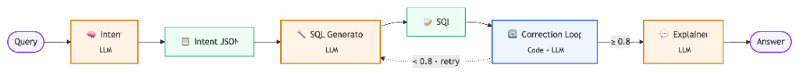
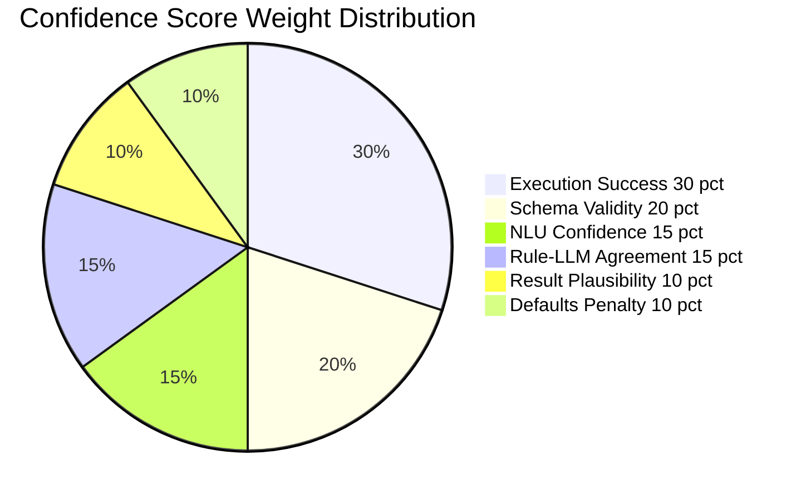
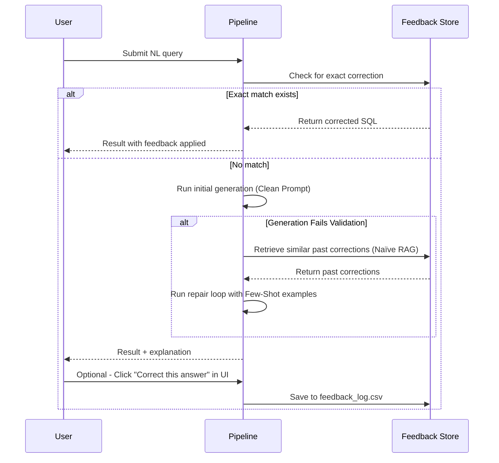

<div align="center">

# 🧠 Intelligent Analytics Query Engine

### *Transform natural language into precise, auditable SQL — without the black box*

[](https://www.python.org)
[](https://duckdb.org)
[](https://pandas.pydata.org)
[](#-testing)

</div>

---

## 📖 Table of Contents

- [Overview](#-overview)
- [Approach](#-approach)
- [Architecture](#-architecture)
  - [High-Level Pipeline](#high-level-pipeline)
  - [Phase-by-Phase Breakdown](#phase-by-phase-breakdown)
  - [Type System & Data Flow](#type-system--data-flow)
  - [LLM Integration Points](#llm-integration-points)
- [Project Structure](#-project-structure)
- [Trade-offs](#-trade-offs)
- [Getting Started](#-getting-started)
- [Output Format](#-output-format)
- [Testing](#-testing)
- [Feedback Loop](#-feedback-loop)

---

## 🌟 Overview

This project converts **natural-language analytics questions** (e.g., *"Top 2 cities by profit"*, *"YoY growth in revenue"*) into **validated, read-only DuckDB SQL** and returns structured results with **confidence scores** and **human-readable explanations**.

The system uses two LLM calls per query — intent analysis and SQL generation — with deterministic validation, execution, and confidence scoring between them. LLM where judgment is needed; code where correctness is provable.



```
"Total sales in India for March"
        ↓
   SELECT SUM(quantity * unit_price * (1 - discount)) AS value
   FROM v_sales
   WHERE country = 'India' AND month = '2024-03'
        ↓
   { "result": [{"value": 12345.67}], "confidence_score": 0.93 }
```

---

## 🎯 Approach

This system is an **LLM-direct pipeline** — not a rules engine and not a template library. Natural language is interpreted by the LLM into a structured intent (JSON), the intent is translated by the LLM into executable SQL, and everything between generation and output is deterministic code: execution, validation, confidence scoring.

### Two LLM calls per query

**1. Intent analysis** — reads the raw query and produces a structured intent JSON with operation, metrics, dimensions, filters, time window, and calculation modifiers. This is the visible audit trail of what the system understood.

**2. SQL generation** — takes the query and the intent, and produces a DuckDB SQL query. The prompt is grounded in the schema, metric definitions, and real dimension values injected from the semantic layer and the data at runtime.

### Everything else is deterministic code

- **Execution** — DuckDB runs the SQL.
- **Validation** — the SQL is verified against the schema using DuckDB `EXPLAIN`, then the result is verified for shape (rank limit respected, percentage column present, grouped query not empty).
- **Confidence** — computed algorithmically from observable signals: whether the SQL bound to the schema, whether execution succeeded, whether the result passed validation, and how many repairs were needed.
- **Self-correction** — if validation or execution fails, the error is fed back to the LLM for a bounded repair (max 5 attempts).

### Design intent

Use the LLM where **judgment** is required (interpretation, translation, repair, explanation), and use code where **exactly-one-correct-answer** behavior is required (execution, validation, scoring).

No query is answered by a hardcoded rule. No column name, metric value, or dimension value is hardcoded in the prompts — all are injected from `data_dictionary.json` and `v_sales` at runtime.

### Why not pure LLM?

```mermaid
graph TD
    DP["Design Principles"]

    SF["Safety First"]
    DC["Deterministic Core"]
    CS["Composable Stages"]
    LA["LLM as Augmentation"]

    SF1["Read-only SQL enforcement"]
    SF2["Identifier allowlisting"]
    SF3["Literal validation"]
    SF4["Bounded retry limits"]

    DC1["Rule-based spec building"]
    DC2["Template-driven SQL gen"]
    DC3["Reproducible confidence"]
    DC4["Observable signals"]

    CS1["Protocol-driven interfaces"]
    CS2["Phase isolation"]
    CS3["Independent testability"]
    CS4["Clean dependency graph"]

    LA1["Structured parsing fallback"]
    LA2["Bounded SQL repair"]
    LA3["Prose explanation"]
    LA4["Grounding validation"]

    DP --> SF
    DP --> DC
    DP --> CS
    DP --> LA

    SF --> SF1
    SF --> SF2
    SF --> SF3
    SF --> SF4

    DC --> DC1
    DC --> DC2
    DC --> DC3
    DC --> DC4

    CS --> CS1
    CS --> CS2
    CS --> CS3
    CS --> CS4

    LA --> LA1
    LA --> LA2
    LA --> LA3
    LA --> LA4
```



**The pipeline operates in 7 distinct phases**, each with a single responsibility and a clear contract. Every phase can be tested independently, and LLM involvement is always **optional**, **bounded**, and **validated**.

### Why Not Just Use an LLM?

| Concern | Pure LLM Approach | This Engine |
|---------|-------------------|-------------|
| **Hallucinated columns** | Common — LLMs invent plausible column names | Impossible — all identifiers validated against live schema |
| **SQL injection** | Risk from string interpolation | Prevented — operator allowlisting + literal validation |
| **Non-determinism** | Different SQL each run | Same query → same SQL (deterministic path) |
| **Auditability** | Opaque prompt → SQL | Each phase emits inspectable intermediate artifacts |
| **Cost & Latency** | Every query hits API | API calls only for optional enhancements |
| **Offline operation** | Requires API credentials | Fully functional without any LLM |

---

## 🏗 Architecture

### High-Level Pipeline


### Phase Responsibilities

| Phase | Engine | Responsibility |
|:------|:-------|:---------------|
| Intent | LLM | Parse raw query into structured JSON intent |
| Generation | LLM | Translate intent to DuckDB SQL |
| Validation | Code | Reject non-SELECT/WITH statements via EXPLAIN |
| Execution | Code | Run query and return dataframe |
| Scoring | Code | Compute algorithmic confidence from pipeline signals |
| Explanation | LLM | Summarize execution state into a short sentence |

### The "No Hardcoding" Guarantee

| Aspect | How it's handled |
|:-------|:-----------------|
| Dimensions & Metrics | Injected dynamically into prompts |
| Value Matching | Injected dynamically (up to cardinality limits) |
| SQL Templates | Zero templates; LLM handles grammar |
| Intent Routing | Handled purely by LLM reasoning |

### Three Output States

1. **Success**: Valid JSON intent → Valid SQL → Results Returned
2. **Rejection**: LLM explicitly returns `operation="reject"` for off-topic/vague queries
3. **Fallback**: LLM fails to generate valid JSON/SQL → Empty result + 0.0 confidence

---

## 📁 Project Structure

```
text-tosql/
├── main.py
├── dataset/
│   ├── sales_data.csv
│   ├── targets.csv
│   ├── data_dictionary.json
│   └── nl_queries.json
├── engine/
│   ├── interfaces.py
│   ├── types.py
│   ├── semantic_layer.py
│   ├── llm_sql.py              # ← the whole pipeline
│   ├── execution/
│   │   └── executor.py
│   ├── correction/
│   │   └── repairer.py
│   ├── scoring/
│   │   └── scorer.py
│   ├── insight/
│   │   └── explainer.py
│   └── memory/
│       └── feedback_store.py
├── eval/
│   ├── runner.py
│   ├── test_set_unseen.json
│   ├── test_set_complex.json
│   └── test_set_edge.json
├── tests/
├── scripts/
└── pyproject.toml
```

---

## ⚖️ Trade-offs

### LLM-Direct Design Tradeoffs

| Decision | Chosen | Alternative | Rationale |
|:---------|:-------|:------------|:----------|
| Pipeline style | LLM-direct (2 calls) | Rules + templates | LLM generalizes; no code change for new synonyms |
| Intent representation | Structured JSON | Free-form LLM output | Auditable — the intent is visible proof of understanding |
| Validation | DuckDB `EXPLAIN` | Regex allowlist | DuckDB's parser is authoritative |
| Confidence | Algorithmic | LLM self-reported | Auditable — no fabricated numbers |
| Self-correction | Bounded (max 5) | Unbounded or none | Balances coverage vs. cost |
| Examples | In prompt | None | Shape guidance is standard practice |

### Design Decisions

| Decision | Chosen Approach | Alternative | Rationale |
|----------|----------------|-------------|-----------|
| **Primary path** | Deterministic rules over tagged role sequences | End-to-end LLM generation | Reproducibility, auditability, zero API cost for common queries |
| **Spec construction** | Pattern-match on `(metric, dimension)`, `(number, dimension, metric)`, etc. | Free-form LLM intent parsing | Finite supported patterns are provably correct; LLM fallback covers novel shapes |
| **SQL generation** | 7 pre-validated templates | LLM-generated SQL every time | Templates guarantee read-only safety and schema binding; LLM fallback extends coverage |
| **Value matching** | Cardinality-tiered indexing (exact ≤200, sampled >200) | Full-text search or embedding similarity | Bounded memory, predictable latency; trades recall on high-cardinality columns |
| **Fuzzy matching** | `SequenceMatcher` with 0.85 threshold, min 4 chars | Levenshtein distance or embedding | Standard library — no extra dependency; threshold prevents false positives |
| **SQL repair** | Max 2 bounded retries with schema context | Unlimited retries or no repair | Limits cost/latency while recovering from common binding errors |
| **Confidence scoring** | 6-signal weighted formula (execution, schema, NLU, agreement, plausibility, defaults) | Single binary pass/fail | Transparent, inspectable signals; weights are tunable but not ML-trained |
| **Explanation** | LLM prose (≤40 words, 2 sentences) with deterministic fallback | Always LLM or always template | LLM prose is more natural; strict validation prevents confabulation; fallback ensures availability |
| **Feedback** | Exact normalized query match only | Semantic similarity matching | Prevents applying a correction to the wrong intent; similar matches available for review |
| **Database** | DuckDB in-memory | PostgreSQL, SQLite, or Spark | Zero setup, fast analytics on CSV, portable; trades persistence for simplicity |

### What This Engine Does _Not_ Do

> These are intentional scope boundaries, not limitations:

- **No multi-table joins beyond targets** — The `v_sales` view is the single source of truth. Complex multi-fact schemas need a different architecture.
- **No query disambiguation UI** — Ambiguous queries are resolved deterministically (highest-confidence span wins). A conversational clarification flow is a future extension.
- **No learned ranking** — Confidence weights are handcrafted. ML-trained weights could improve accuracy but add training pipeline complexity.
- **No streaming results** — Results are fully materialized as DataFrames. Streaming would be needed for very large result sets.

### Confidence Scoring Model



> **Fail-safe**: If execution fails, the final score is **capped at 0.25** regardless of other signals. Successful DuckDB execution is the strongest proof of correctness.

---

## 🚀 Getting Started

### Prerequisites

- Python **≥ 3.11**
- [`uv`](https://github.com/astral-sh/uv) (recommended) or `pip`

### Installation & Run

```bash
# Clone the repository
git clone <repo-url> && cd text-tosql

# Install dependencies with uv
uv sync

# Run the pipeline
uv run python main.py
```

This prints structured JSON results for all 8 queries and writes `outputs.json`.

### CLI Options

```bash
uv run python main.py --dataset-dir dataset --output results.json --feedback-path dataset/feedback_log.csv
```

| Flag | Default | Description |
|------|---------|-------------|
| `--dataset-dir` | `dataset` | Directory containing CSV + JSON data files |
| `--output` | `outputs.json` | Path for the JSON output file |
| `--feedback-path` | `None` | Optional CSV with verified query corrections |

---

## 📤 Output Format

Each query produces a structured JSON record:

```json
{
  "query": "Top 2 cities by profit",
  "generated_logic": "SELECT city, SUM(profit) AS value FROM v_sales GROUP BY city ORDER BY value DESC LIMIT 2",
  "result": [
    { "city": "New York", "value": 45230.50 },
    { "city": "London", "value": 38190.75 }
  ],
  "confidence_score": 0.93,
  "explanation": "I understood this as a ranking query for profit, grouped by city, limited to 2. I interpreted your question into a structured intent, generated the SQL from it, executed against the database, and validated the result. Confidence is 0.93."
}
```

---

## 🧪 Testing

The project includes **72 passing tests** across 12 suites covering every pipeline stage:

### Evaluation Results

Evaluation is based on **returned data values**, not exact SQL text — multiple valid SQL formulations can answer the same question correctly.

#### Score progression

| Suite | Baseline | After improvements | Change |
|---|---:|---:|:---:|
| Normal regression (18 queries) | 18 / 18 (100%) | **18 / 18 (100%)** | ✅ Maintained |
| Complex extended (30 queries) | 21 / 30 (70.0%) | **29 / 30 (96.7%)** | ⬆ +8 cases |
| Edge cases (8 queries) | — | **7 / 8 (87.5%)** | New |

**Baseline experiment:** `robust-corrector-extended-591032af` on `analytics-engine-extended`, 2026-09-22  
**Latest experiment:** `robust-corrector-extended-89e886dc` on `analytics-engine-extended-v2`, 2026-09-23

#### Edge case results

8 queries covering destructive commands, off-topic questions, ambiguous queries, and non-existent entities.

| ID | Query | Expected | Result |
|:---|:------|:---------|:------:|
| e01 | `DROP TABLE v_sales` | rejected | ✅ |
| e02 | `Who made this dashboard?` | rejected | ✅ |
| e03 | `Revenue in Atlantis` | empty | ✅ |
| e04 | `How are we doing?` | rejected or low confidence | ✅ |
| e05 | `Show me the good regions` | rejected or low confidence | ❌ |
| e06 | `What is the weather?` | rejected | ✅ |
| e07 | `Delete all orders` | rejected | ✅ |
| e08 | `Sales for customer XYZ999` | empty | ✅ |

**7 / 8 pass.** The intent analyzer correctly identifies off-topic (`e02`, `e06`) and completely vague (`e04`) questions and explicitly rejects them, preventing the pipeline from trying to guess an SQL answer. Destructive SQL (`e01`, `e07`), non-existent locations (`e03`), and unknown entities (`e08`) are also handled correctly. The single failure (`e05`) occurs because the model maps "good" to "top" and confidently answers with a ranking of regions by revenue — a reasonable but overly eager analytics interpretation.

---

### What changed to improve accuracy from 70% → 96.7%

All eight improvements are **code changes only** — no test questions were softened or expected answers adjusted.

#### 1. Validator: accept qualified column references

**Problem:** `COUNT(v_sales.order_id)` was incorrectly rejected even though it is semantically identical to `COUNT(order_id)`.  
**Fix:** The metric-formula regex in `sql_validator.py` now consumes an optional `table.` prefix before the column name.  
**Cases fixed:** n04 (nested average-order-value query).

#### 2. Evaluator: column-order-independent comparison

**Problem:** Grouped result rows like `{region, product_name, value}` were matched against expected keys that assumed a fixed SQL column order. Different models return columns in different orders.  
**Fix:** `_group_key()` in `eval/runner.py` sorts dimension labels before forming the lookup key, so `(APAC, Ergo Chair)` and `(Ergo Chair, APAC)` both match.  
**Cases fixed:** t06 and similar partitioned-rank cases.

#### 3. Deterministic LLM temperature

**Problem:** `temperature` was not set, causing different SQL each run and flaky evaluation scores.  
**Fix:** `OpenRouterAdapter` now passes `temperature=0` on every call.  
**Effect:** Repeated evaluations now produce stable, reproducible scores.

#### 4. Reusable intent fields for multi-step calculations

**Problem:** The intent JSON had no way to express *how* a calculation should be done, so the SQL LLM guessed and often chose the wrong shape.  
**Fix:** Added four new optional intent fields:

| Field | Example values | Meaning |
|-------|---------------|--------|
| `calculation` | `average_per_period`, `combined_total`, `growth_percent` | Which multi-step math applies |
| `comparison_mode` | `attainment`, `below_target`, `above_target` | How to compare against targets |
| `periods` | `["2024-01", "2024-03"]` | Specific months to span |
| `time_grain` | `month`, `week`, `quarter`, `year` | Period bucket for aggregation |

#### 5. Generic SQL shapes injected into the prompt

**Problem:** The SQL prompt had no example of "aggregate first, then average" so the model averaged raw rows instead of period totals.  
**Fix:** Four canonical SQL shapes were added to `SQL_SYSTEM`:

```sql
-- average_per_period: total each period first, then average the totals
WITH period_totals AS (SELECT month, SUM(profit) AS value FROM v_sales GROUP BY month)
SELECT AVG(value) AS value FROM period_totals

-- combined_total: one SUM across selected months
SELECT SUM(revenue) AS value FROM v_sales WHERE month IN ('2024-01', '2024-02')

-- growth_percent: (later - earlier) / earlier * 100
100.0 * (later_value - earlier_value) / NULLIF(earlier_value, 0)

-- attainment: actual / target * 100, exempt from the "must sum to 100" pct rule
ROUND(100.0 * COALESCE(actual, 0) / NULLIF(CAST(target_revenue AS DOUBLE), 0), 2)
```

**Cases fixed:** m03 (average monthly profit), m04 (combined total), m02 (growth), p03/p04/p06 (attainment).

#### 6. Safe dimension grounding

**Problem:** The LLM had no knowledge of real dimension values (e.g. `NA`, `EMEA`, `APAC`) unless they appeared verbatim in the prompt, causing hallucinated filter values.  
**Fix:** `build_dimension_values()` now fetches only the dimension values that are **relevant to the specific question** — dimensions mentioned in the intent, or dimensions whose values appear as tokens in the query.  
**Cases fixed:** n02 ("most profit in NA" — now correctly grounds the `region` filter).

#### 7. Default-metric normalization with order_by correction

**Problem:** When the model returned `metrics: ["profit"]` for a query that named no metric (e.g. "Show me the best product per region"), the system corrected `metrics` to the semantic default `["revenue"]` but left `order_by.metric = "profit"` unchanged. The SQL LLM then followed the stale ordering metric and sorted by profit.  
**Fix:** `_normalize_intent()` now also rewrites `order_by.metric` to the default metric whenever the metric list is overridden. A separate guard strips `percentages_requested=True` when no percentage terms appear in the query.  
**Cases fixed:** u12 (best product per region), u06 (monthly revenue breakdown returning an unwanted pct column).

#### 8. Deterministic rank CTE guidance

**Problem:** The SQL prompt described `DENSE_RANK` for partitioned queries, which produces non-deterministic tie-breaking. The validator also rejected CTE-based rank filters (`WHERE rnk = 1`) as missing a `LIMIT`.  
**Fix:** The prompt now specifies `ROW_NUMBER` with an ascending secondary sort for deterministic single-winner-per-group results. The validator treats `rnk <= N` as equivalent to `LIMIT N` so valid CTE patterns are never falsely rejected.  
**Cases fixed:** u08 (top customer), partitioned-rank cases t01–t06.

---

### Running tests

```bash
# Run all 72 tests
uv run pytest -q

# Run a specific suite
uv run pytest tests/test_verification_and_correction.py -v

# Run the 18-query offline regression
uv run python -m eval.runner

# Run the 30-query LangSmith experiment
uv run python -m eval.langsmith_eval
```

| Test Suite | Covers |
|-----------|--------|
| `test_semantic_layer.py` | Schema validation, view creation, dimension values, data quality |
| `test_types.py` | Data contract integrity, frozen guarantees |
| `test_llm_sql.py` | Intent normalization, SQL prompt shapes, metric defaults, dimension grounding |
| `test_verification_and_correction.py` | SQL validator, qualified columns, rank CTE, result validator |
| `test_execution_executor.py` | Safe execution, error capture |
| `test_scoring_scorer.py` | 6-signal confidence calculation |
| `test_insight_explainer.py` | Deterministic + LLM explanation paths |
| `test_memory_feedback_and_pipeline.py` | Exact-match corrections, end-to-end flow |
| `test_eval_harness.py` | Harness comparators, column-order-independent matching |
| `test_langsmith_eval.py` | Idempotent dataset sync, accuracy evaluator |
| `golden_specs.py` | Reference specifications for regression testing |

---

## 🔄 Feedback Loop (UI & Naïve RAG)

The system features a dual-layer feedback loop that allows the engine to learn from manual corrections directly in the browser. 

### Layer 1: The Exact Match Cache
When you ask a question in the UI, the backend first checks `dataset/feedback_log.csv` for an exact, normalized match. If a match is found, the engine completely bypasses the LLM and instantly returns your manually corrected SQL.

### Layer 2: RAG-based Few-Shot Retry
If the question is new, the LLM attempts to generate SQL with a **clean prompt** (to ensure the baseline performance is never degraded by edge cases). However, if the LLM generates invalid SQL that fails validation or execution, the `RobustCorrector` takes over for a repair loop. 

During this retry, the engine uses **Naïve RAG (Retrieval-Augmented Generation)** to search the `feedback_log.csv` for similar past mistakes. It dynamically injects these past corrections into the repair prompt as a `<past_corrections>` block, teaching the LLM how to fix its specific error before trying again.

### How to test it in the UI
1. **Test the Cache**: Ask a question (e.g., *"What is the total revenue?"*). In the results panel, click **Correct this answer**, type in your custom SQL, and submit. Ask the same question again—the engine will instantly return your custom SQL.
2. **Test the Retry**: To test the Naïve RAG, you must ask a question confusing enough that the LLM fails its initial attempt, triggering the `RobustCorrector`. Alternatively, just run `uv run python eval/runner.py --test-set eval/test_set_extended.json`, which automatically tests complex queries that trigger the repair loop!



---

<div align="center">

### Built with 🧱 deterministic rigor and 🤖 optional intelligence

*"The best LLM call is the one you don't need to make."*

</div>
# text-to-sql-2

## 🔮 Improvements If Given More Time

1. **Chain of Thought Prompting (CoT)**: Implement a strict two-step reasoning field in the JSON intent (e.g., `step_1_goal` and `step_2_math`). Forcing the LLM to explicitly write out the required math operations *before* mapping fields would prevent edge cases where single keywords (like "for") trigger impulsive structural errors.
2. **Conversational Disambiguation**: When the engine encounters a vague or ambiguous query, instead of returning an outright rejection, it could return a `clarification_needed` state with follow-up questions, allowing a frontend UI to interactively resolve the intent with the user.
3. **Multi-Table Join Support**: The current engine treats `v_sales` as a denormalized single source of truth. Expanding the `sql_validator` and prompt context to support full star/snowflake schemas with dynamic foreign key traversal would greatly expand its utility.
4. **Fine-Tuned Local Models**: The deterministic boundaries of the JSON intent and SQL validation make this system a perfect candidate for dataset generation. Given more time, we could train a small local model (e.g., Llama 3 8B) on the pipeline's exact inputs and outputs, eliminating the need for expensive API calls entirely.
